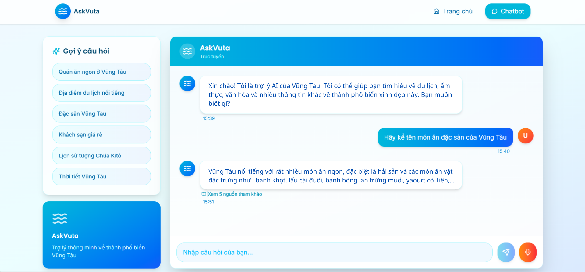

# ASKVUTA

**AskVuta** is a domain-specific Retrieval-Augmented Generation (RAG) chatbot built exclusively for the coastal city of Vung Tau, Vietnam. The system automatically crawls and ingests articles from trusted Vietnamese websites covering tourism, cuisine, history, and local economy — then indexes everything through the OpenRAG pipeline to serve accurate, context-aware answers in natural language. When a user asks a question, AskVuta doesn't simply match keywords: it runs multiple retrieval strategies in parallel, fuses the results, and passes the top candidates to **Arcee-VyLinh-3B** to generate a fluent, well-grounded response.

What makes AskVuta stand out is its core integration with **OpenRAG** — an open-source, multi-strategy RAG library combining three state-of-the-art techniques: **RAPTOR** (recursive hierarchical document trees), **BM25 Hybrid Search** (fusing dense semantic retrieval with sparse keyword matching), and **Neural Reranking** (Cohere cross-encoder rescoring). The impact of combining all three is validated by a rigorous ablation study: starting from 55.2% Recall@10 with semantic search alone, the full pipeline reaches **72.89%** — surpassing even RAPTOR's own baseline (~70%) on the MultiHop-RAG benchmark.

---

## Chat Interface

<p align="center">
  
</p>

---

## Features

- **Automated web crawler** collecting Vung Tau articles by topic (tourism, cuisine, history, economy)
- **OpenRAG pipeline** — RAPTOR + BM25 Hybrid + Neural Reranking
- **FAISS vector store** backed by `paraphrase-multilingual-mpnet-base-v2` embeddings
- **Chat interface** built with React 18 + Vite + Tailwind CSS + Radix UI
- **FastAPI backend** exposing `/health`, `/info`, `/search`, and `/chat` endpoints
- **Vietnamese language support** via multilingual embeddings and the Arcee-VyLinh-3B LLM

---

## System Architecture

```
     DATA PREPARATION                  QUESTION ANSWERING
──────────────────────────        ───────────────────────────────

┌────────────────────┐
│   Crawl Sources    │
└─────────┬──────────┘
          │
          ▼
┌────────────────────┐
│    Process Data    │
│ (Chunk + RAPTOR)   │
└─────────┬──────────┘
          │
          ▼
┌────────────────────┐
│    Build Index     │
│ (Vector + BM25)    │
└─────────┬──────────┘
          │
          ▼
┌────────────────────┐
│   Knowledge Base   │──────────────────────────────┐
└────────────────────┘                              │
                                                    ▼
                                         ┌────────────────────┐
                                         │     User Query     │
                                         └─────────┬──────────┘
                                                   │
                                                   ▼
                                         ┌────────────────────┐
                                         │   Hybrid Search    │
                                         └─────────┬──────────┘
                                                   │
                                                   ▼
                                         ┌────────────────────┐
                                         │      Rerank        │
                                         └─────────┬──────────┘
                                                   │
                                                   ▼
                                         ┌────────────────────┐
                                         │        LLM         │
                                         └─────────┬──────────┘
                                                   │
                                                   ▼
                                         ┌────────────────────┐
                                         │       Answer       │
                                         └────────────────────┘
```

---

## 🚀 What Makes AskVuta Powerful: The OpenRAG Trio

AskVuta's retrieval quality is backed by **[OpenRAG](https://github.com/incidentfox/OpenRag)**, validated across thousands of queries:

| Configuration | Recall@10 | Δ vs Baseline |
|---|---|---|
| Semantic search only | 55.2% | — |
| + RAPTOR hierarchy | 62.5% | +7.3% |
| + Cohere reranking | 71.8% | +16.6% |
| + BM25 hybrid | 72.4% | +17.2% |
| + HyDE + Query decomposition | **72.89%** | **+17.7%** |

---

### 🌲 1. RAPTOR – Hierarchical Tree Retrieval

**RAPTOR** (Recursive Abstractive Processing for Tree-Organized Retrieval) organizes documents into a recursive tree rather than treating them as a flat list of chunks like traditional RAG.

**How it works:**
1. Split documents into small chunks (leaf nodes)
2. Cluster semantically similar chunks using UMAP + Gaussian Mixture Models
3. Use an LLM to generate a **summary** for each cluster → this becomes a parent node
4. Repeat recursively until a single root summary covers the full corpus

**Why RAPTOR beats flat RAG:**
> Standard RAG can only retrieve small, specific chunks — it misses broader context. RAPTOR enables retrieval at multiple levels of abstraction: specific details *and* high-level summaries in one query. A question like *"How has tourism in Vung Tau evolved over different historical periods?"* is answered far better because the system can pull both granular chunk details and synthesized cluster summaries. In the ablation study, RAPTOR alone added **+7.3%** Recall@10 over baseline.

---

### 🔀 2. BM25 Hybrid Search

Combines two complementary retrieval methods, merged via **Reciprocal Rank Fusion (RRF)**:

| Method | Mechanism | Strength |
|---|---|---|
| **Dense search** (vector) | Embedding → cosine similarity | Semantic understanding, synonyms |
| **BM25** (sparse/keyword) | TF-IDF over exact tokens | Precise name, place, and date matching |

**Why you need both:**
> Vector search understands meaning but often misses proper nouns and specific place names. BM25 matches exact keywords but has no semantic understanding. A query like *"Best banh khot in Ba Ria – Vung Tau"* needs both: vector search recognizes "banh khot" as a local specialty, while BM25 ensures the exact place name "Ba Ria – Vung Tau" is matched precisely. Adding hybrid search on top of RAPTOR and reranking contributed another **+0.6%** in recall.

---

### 🎯 3. Neural Reranking

After retrieval returns ~20 candidates, **Cohere `rerank-english-v3.0`** (or `BAAI/bge-reranker-base` for local inference) reads each *(query, document)* pair jointly to produce a more accurate relevance score.

**Two-stage pipeline:**
```
Query ──► [Hybrid Search] ──► top-20 candidates
                          ──► [Neural Reranker] ──► top-5
                                                ──► LLM
```

**Why a reranker outperforms embeddings alone:**
> Embedding models encode the query and document **separately** and compare the resulting vectors — they cannot directly model the relationship between the two. A cross-encoder reads **both simultaneously**, capturing token-level interactions that embeddings miss. This is the single highest-impact component in the entire pipeline: reranking alone added **+9.3 percentage points** in the ablation study. If no Cohere API key is set, the system automatically falls back to the `CrossEncoderReranker` running fully locally — no external API required.

---


## Quick Start

### 1. Install dependencies
```bash
pip install -r requirements.txt
```

### 2. Clone OpenRag 
```bash
# Clone the repo
git clone https://github.com/incidentfox/OpenRag.git
cd OpenRag
# Install requirements
pip install -r requirements.txt
```

### 3. Crawl articles (optional – dataset already included)
```bash
python backend/crawler/crawl_articles.py
```

### 4. Build the RAG index
```bash
python scripts/build_rag.py
```

### 5. Run the backend
```bash
python backend/app/main.py
# or from backend/ directory:
uvicorn app.main:app --reload
```

### 6. Run the frontend
```bash
cd frontend
npm install
npm run dev
```

## Repository Structure 

```
ASKVUTA/
├── backend/
│   ├── app/                    # FastAPI application
│   │   ├── api/routes.py       # API endpoints (/health, /search, /chat)
│   │   ├── core/               # Config & VectorStore
│   │   ├── models/             # Pydantic request/response models
│   │   ├── services/           # LLM, Search, RAG services
│   │   └── utils/              # Prompt builder
│   ├── crawler/                # Web scraper for Vũng Tàu articles
│   └── loaders/                # OpenRAG selective import loader
│
├── frontend/                   # React + Vite + Tailwind UI
│
├── data/
│   ├── dataset/                # Crawled JSON articles by topic
│   └── embeddings/             # FAISS vector store (vungtau_knowledge.pkl)
│
├── scripts/
│   └── build_rag.py            # Build FAISS index from dataset
│
├── OpenRag/                    # OpenRAG library 
├── requirements.txt
└── README.md
```

## API Endpoints

| Method | Path | Description |
|--------|------|-------------|
| GET | `/health` | Server health check |
| GET | `/info` | Vector store info |
| GET | `/search?query=...` | Semantic document search |
| POST | `/chat` | RAG-powered Q&A |

## Tech Stack

| Layer | Technology |
|---|---|
| **Backend** | FastAPI + FAISS (via OpenRAG) |
| **LLM** | Arcee-VyLinh-3B |
| **Embeddings** | `paraphrase-multilingual-mpnet-base-v2` (SentenceTransformers) |
| **RAG Engine** | OpenRAG — RAPTOR + BM25 Hybrid + Cohere Reranker |
| **Frontend** | React 18 + Vite + Tailwind CSS + Radix UI |
| **Vector Store** | FAISS (`.pkl`) + JSON dataset |
